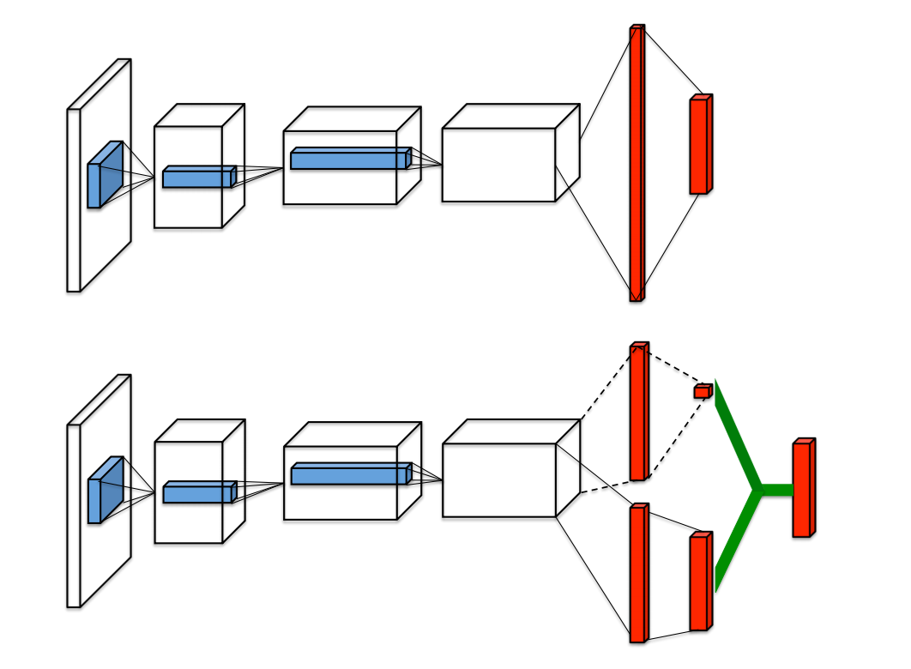
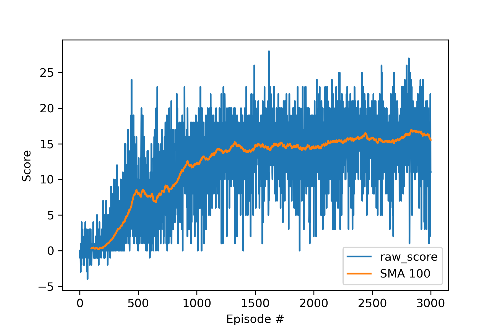
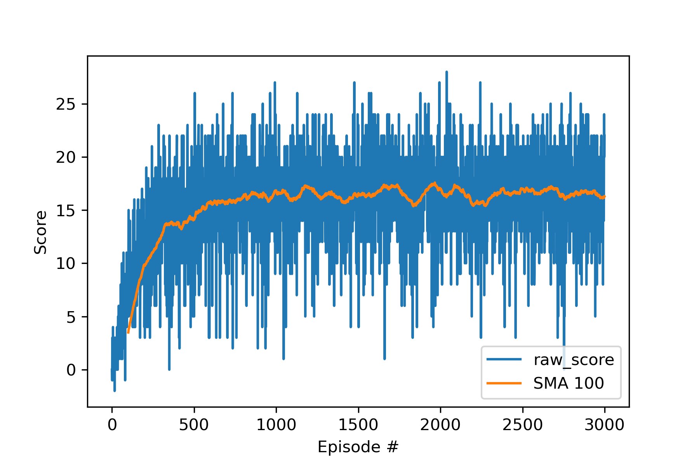

[image1]: https://user-images.githubusercontent.com/10624937/42135619-d90f2f28-7d12-11e8-8823-82b970a54d7e.gif "Trained Agent"

# Project 1: Navigation

### Introduction

In this project, I demonstrated and compared the performances of several variants of Deep Q-learning (DQN), also commonly referred to as the value-based methods. Perceptively, the following DQN architectures were considered:

* Vanilla Deep Q-learning
* Vanilla Deep Q-learning with dueling network
* Double Deep Q-learning
* Double Deep Q-learning with dueling network

We utilized an Unity reinforcement learning to perform comparison studies among the above four variants. The environment  of our interest consists of a continuous state space of 37 dimensions and 4 actions i.e. move left, move right, move forward and move backward. An agent can move around to collect yellow bananas for a reward of +1 score, while avoiding eating the blue bananas for a penalty of -1 score.  An agent with random action can be seen as the following animation:

In the following sections, I will discuss the implementation of the above DQN architectures, compares their performance on the banana collection task and present some ideas for future improvement. 

### Learning Algorithm

The main idea for various DQNs is to learn the action-value function, noted as $Q(s,a)$ ($s$ is the current state and $a$ is the corresponding action), using deep neural network as an non-linear approximation. Q-learning is a type of Temporal-Difference (TD) learning that learn from each step in a given learning episode.  Given a tuple of $(S_t, A_t, R_t, S_{t+1})$, the Q-learning aims to update the following action-value table
$$
Q(S_t,A_t) \leftarrow Q(S_t, A_t) + \alpha \left(R_{t+1} + \gamma \max_{a} Q(S_{t+1}, a) - Q(S_t, A_t)\right)
$$
where $S_t, A_t, R_t$ are the state, action, reward at time step $t$ and $S_{t+1}$ is the next state that follows. However, the above Q-table becomes infeasible as the dimension of state and action space increases.  Then as first proposed by the  [Deep Q learning](https://storage.googleapis.com/deepmind-media/dqn/DQNNaturePaper.pdf) paper, we attempt to approximate this Q-table using a network $\hat{q}$ parameterized by a weight matrix $w$, and iteratively update the weight parameter using the following rule:
$$
\nabla w = \alpha \left(R_{t+1} + \gamma \max_{a} \hat{q}(S_{t+1}, a, w^{-}) - \hat{q}(S_t, A_t, w)\right) \nabla\hat{q}(S_t, A_t, w)
$$

where $w^-$ are the weights of a fixed separate target network during the learning step, decoupling the target from the parameter updating step. 

In the implementation, we use two feed-forward networks: one online network that is keeping on learning; the other target network whose parameters are set by the online network every few iteration. Since the two networks sometime share the same weights, their network architectures are the same and are specified as following:

* Layer 1, Fully connected layer, Input dimension 37 (the size of the state space), Output dimension 128 with Relu activation;
* Layer 2, Fully connected layer, Input dimension 128, Output dimension 64 with Relu activation;
* Layer 3, Fully connected layer, Input dimension 64, Output dimension 4 (the size of the action space) with Relu activation.

We also applied a technique called **experiences replays** (EP) to stabilize the training, where a EP buffer is used to store batches of $\left(S_t, A_t, R_t, S_{t+1}\right)$ experience tuple from past episodes.  After running through a large number of episodes, we randomly sample a few experience tuples and learn from them to update the parameters of Q-network. This stochastic sampling breaks the sequential nature of experiences, reduce correlation, and stabilizes the learning process considerably. 

To further improve performance of DQN, we implement two variants of it. 

## Double DQN
Since the Vanilla DQN can overestimate the action-values. the paper *[Deep Reinforcement Learning with Double Q-learning](https://arxiv.org/abs/1509.06461)*  proposed an alternative Q-target value which takes the action that maximizes the current Q network given the next state.  According to the paper, the weights $w$ is updated using the following gradient, instead.
$$
\nabla w = \alpha \left(R_{t+1} + \gamma \hat{q}\left(S_{t+1}, \arg\max_{a}\hat{q}(S_{t+1}, a, w), w^{-}\right) - \hat{q}(S_t, A_t, w)\right) \nabla\hat{q}(S_t, A_t, w)
$$

## Dueling Network

The  [Dueling Network Architectures for Deep Reinforcement Learning](https://arxiv.org/abs/1511.06581) proposes a different neural network to approximate the Q functions. In the final layer, the dueling network separates the target into two tasks: (1) Estimate the state-value function, and (2) Estimate the the advantages for each action within the state. Then those two estimates are combined together and are used to approximate the Q-values as below:
$$
Q(S_t, A_t;w,\alpha,\beta) = V(S_t;w,\beta) +A(S_t, A_t;w,\alpha) - \dfrac{1}{|\mathcal{A}|} \sum_{a^{'}}A(S_t, a^{'};w,\alpha)
$$

$w$ is shared between those two networks (all the layers before the last layer), while  $\alpha$ and $\beta$ are the parameters of the two streams of the fully connected layers for estimating the state-value $V(S_t)$ and advantage  $A(S_,A_t)$, respectively. 

## Hyper-parameter Setting

| Parameter    | values | Meaning                                                      |
| ------------ | ------ | ------------------------------------------------------------ |
| lr           | 1e-3   | The learning rate for the deep q network.                    |
| BUFFER_SIZE  | 1e6    | The size for the replay memory                               |
| UPDATE_CYCLE | 8      | The weight is trained every 8 steps.                         |
| GAMMA        | 0.99   | The reward decay factor.                                     |
| TAU          | 1e-3   | The portion of new local_parameters are updated to target parameters. |
| BATCH_SIZE   | 64     | The batch size for each training of the deep q network.      |

# Results

Please follow the instructions in `Navigation_solution.ipynb` to train the agent for 3000 episodes using the above hypermeter setting. We then calculate the average reward for a testing set of 10 episodes. We can see that all the four methods achieve an average score above 15, which show the agents learned to play the game from interacting with the simulation environment.  Each method takes more than 1 hour to train for 3000 episodes. 

|     Model      | Avg Reward (Test) | Time (seconds) |
| :------------: | :---------------: | :------------: |
|      DQN       |       17.2        |    4146.114    |
| DQN + Dueling  |       17.9        |    5343.128    |
|      DDQN      |       15.7        |    4535.469    |
| DDQN + Dueling |       15.3        |    5536.724    |

I also plot the trace plot of reward versus the training episode overlaying the SMA 100 per each methods. 

|                             DQN                              |                        DQN + Dueling                         |
| :----------------------------------------------------------: | :----------------------------------------------------------: |
|  |  |
|                           **DDQN**                           |                      **DDQN + Dueling**                      |
|  |  |

If we plot the SMAs for all four methods together, we can see the following graph:

where we can see when dueling is turned on the rewards start much higher than when without.  However, the benefits of double DQN is not significant better than the Vanilla DQN. This disadvantage might be due to this specific problem or because of some bug in my code. 

### Future work

I plan to investigate a comparison studies among all four methods to learn the strategies directly from the 84 x 84 RGB image from the agent's first-person view. I would like to understand the robustness of the approaches when a different hyper-parameter was used and further optimize it using Bayesian inference. Lastly, I will learn more about some state-of-art value-based approaches such as the Rainbow learning algorithm.