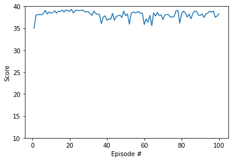

# Project Report: Train a double arm to reach target locations using the DDPG algorithm

## Introduction

In this project, I demonstrated the performance of Deep Deterministic Policy Gradient (DDPG) algorithm to control 20 double-joined arm to target locations. A reward score of +0.1 is given to each agent if the agent's hand is in the correct goal location for each time step. Our goal is to achieve an average score of more than +30 for all 20 agents and maintain their positions at the targeted goal locations as long as possible. We can see from the results section, the DDPG algorithm is very efficient and it attained an averaged score of more than +30 for less than 15 training episodes. And DDPG is fairly robust as it continues to achieve an averaged score of around +38 for another 100 consecutive episodes over all the agents. 

DDPG is a actor-critic, model-free algorithm which is based on deterministic policy gradient. It is a model-free,  off-policy and actor-critic RL approach that  uses deep learning as functional approximator to learn policies in high-dimensional, continuous action spaces. It composes of a policy network as well as a value network. The former network, also known as **actor network**, generates actions given an input states; the later network, also referred to as **critic network**,  maps given inputs states and actions to Q-values. The detailed algorithm in the paper is specified below:

 

## Model Architecture

* Actor Network

  | Network Layer  | Size | Activation Function |
  | -------------- | :--: | :-----------------: |
  | Hidden Layer 1 | 256  |        ReLu         |
  | Hidden Layer 2 | 128  |        ReLu         |
  | Output Layer   |  4   |        tanh         |

* Critic Network

  | Network Layer  | Size | Activation Function |
  | -------------- | :--: | :-----------------: |
  | Hidden Layer 1 | 256  |        ReLu         |
  | Hidden Layer 2 | 128  |        ReLu         |
  | Output Layer   |  4   |        tanh         |

* Hyperparameters

  | Param Name         | Value | Explain                                        |
  | ------------------ | ----- | ---------------------------------------------- |
  | BUFFER_SIZE        | 1e6   | Replay buffer size for Critic network          |
  | BATCH_SIZE         | 128   | Minibatch size for each trading Epoch          |
  | GAMMA              | 0.99  | Discount factor                                |
  | TAU                | 1e-3  | Soft update of the target model parameters     |
  | LR_ACTOR           | 1e-3  | Learning rate for the actor network            |
  | LR_CRITIC          | 1e-4  | Learning rate for the critic network           |
  | LR_DECAY           | 0.99  | Learning rate decaying factor for each episode |
  | NOISE_DECAY_FACTOR | 0.999 | Noisy decay factor for each sampling           |

  ## LR Results

  I applied decaying learning rate and random noise sampled from the Ornstein-Uhlenbeck process to generate temporally correlated samples as specified by the `LR_DECAY` and `NOISE_DECAY_FACTOR` hyperparameters. Those help improve the RL training performance considerably. I pretrained the RL agents for 30 episode and achieve an average score above 35. To access the robustness of the agent, I then warm started RL agent using pre-saved parameters and process another 100 training episodes. It takes almost a whole day to finish the scheduled training process in a GTX 970 graphic card. The trace plots of the averaged score across 20 agents for the first 30 episodes and for the second 100 episodes are as follows:

  |      First 30 Training Episodes       |     Second 100 Training Episodes      |
  | :-----------------------------------: | :-----------------------------------: |
  |  |  |

  The DDPG performance on the testing set is demonstrated as the following video clip. We can see that all agents can catch and track the motions of the targeted balls pretty well. 

  

  

## Future Research

I noticed that training DDPG over 20 agents is very slow as it takes more than 1 day to train 130 episodes. One solution of this slow speed is to explore to train 20 agents in a distributed system such as spark to massively parallelize the training process, and reduces training time. It is also worthwhile to compare DDPG with the other actor-critic methods, such as D4PG, A2C, A3C etc. and benchmark the performance among those RL methods. 

## Reference

https://github.com/udacity/deep-reinforcement-learning/tree/master/ddpg-pendulum

[Continuous Control With Deep Reinforecement Learning](https://arxiv.org/abs/1509.02971)

[Distributed Distributional Deterministic Policy Gradient ](https://arxiv.org/abs/1804.08617)

