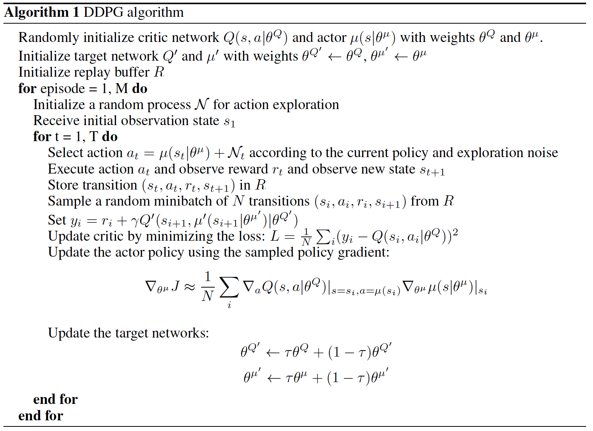
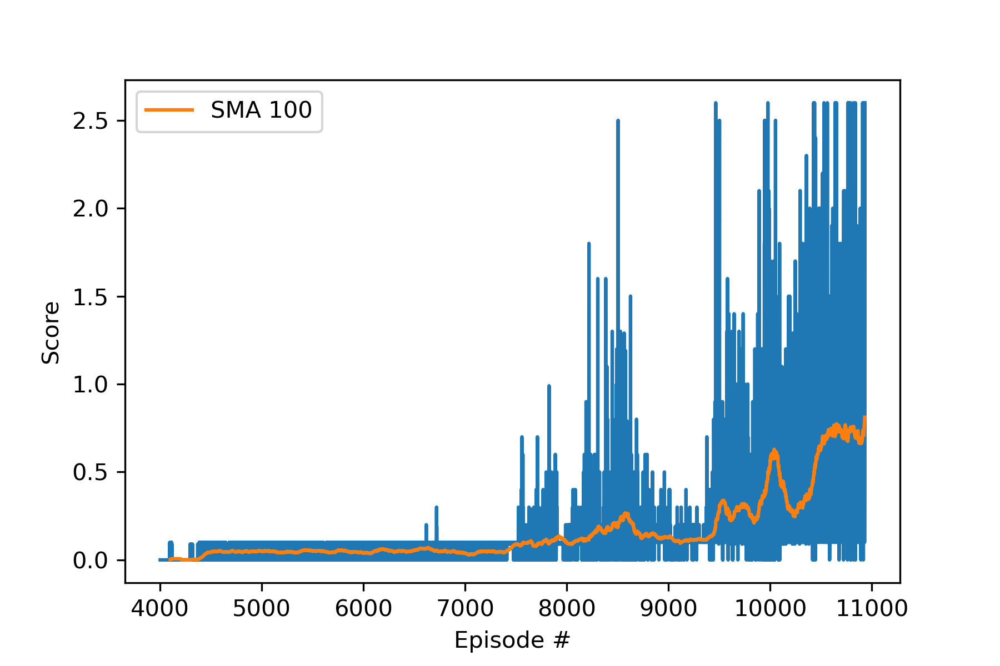
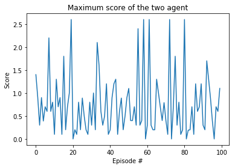
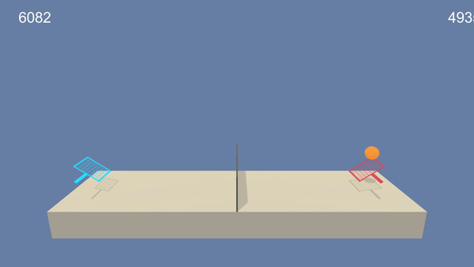

## Collaboration and Competition using DDPG algorithm

## Introduction

In this project, I demonstrated training two AI agents to control rackets using DDPG ( Deep Deterministic Policy Gradient) algorithm in order to bounce a ball over a net. If an agent hits the ball over the net, it will receive a reward of +0.1. However, if it hits a ball to the ground or out of bounds, then it will receive a negative reward of -0.01. Our goal is to keep the ball in play. We can see from the results section: despite that the DDPG algorithm learns little before around episode 7,000 and shows little sign of learning, it later catches up and achieves an averaged score of over +0.9 over 100 episodes. 

DDPG is a actor-critic, model-free algorithm which is based on deterministic policy gradient. It is a model-free, off-policy and actor-critic RL approach that uses deep learning as functional approximator to learn policies in high-dimensional, continuous action spaces. It composes of a policy network as well as a value network. The former network, also known as **actor network**, generates actions given an input states; the later network, also referred to as **critic network**, maps given inputs states and actions to Q-values. The detailed algorithm in the paper is specified below:

## Model Architecture

- Actor Network for Agent 0 and 1

  | Network Layer  | Size | Activation Function |
  | -------------- | ---- | ------------------- |
  | Hidden Layer 1 | 256  | ReLu                |
  | Hidden Layer 2 | 128  | ReLu                |
  | Output Layer   | 2    | tanh                |

- Critic Network for Agent 0 and 1

  | Network Layer  | Size | Activation Function |
  | -------------- | ---- | ------------------- |
  | Hidden Layer 1 | 256  | ReLu                |
  | Hidden Layer 2 | 128  | ReLu                |
  | Output Layer   | 1    | tanh                |

- Hyperparameters

  | Param Name           | Value | Explain                                          |
  | -------------------- | ----- | ------------------------------------------------ |
  | BUFFER_SIZE          | 1e6   | Replay buffer size for Critic network            |
  | BATCH_SIZE           | 256   | Minibatch size for each trading Epoch            |
  | GAMMA                | 0.98  | Discount factor                                  |
  | TAU                  | 1e-3  | Soft update of the target model parameters       |
  | LR_ACTOR             | 1e-4  | Learning rate for the actor network              |
  | LR_CRITIC            | 1e-3  | Learning rate for the critic network             |
  | UPDATE_EVERY_N_STEPS | 20    | The frequency the network is updated             |
  | UPDATE_TIMES         | 10    | The times to execute gradient descent per update |
  | EPSILON              | 1     | The random noise added to the actions            |
  | EPSILON_DECAY        | 1e-3  | The decay rate for EPSILON                       |

## Results

I applied decaying learning rate and random noise sampled from the Ornstein-Uhlenbeck process to generate temporally correlated samples as specified by the `EPSILON` and `EPSILON_DECAY` hyperparameters. The trace plots of the maximum score of the two agents in the training set for 11000 episodes in the left figure where the 100 SMA (shown as solid yellow line) shows the DDPG starts learning around 9500 episodes and then accomplished an average score over consecutive 100 episodes larger than +0.9 score. The right figure shows the performance of the two RL agents on testing set and DDPG is able to attain a positive score of +0.7073 over the 100 testing episodes. 

|                 Training Scores v.s. Episode                 |                 Testing Scores v.s. Episode                  |
| :----------------------------------------------------------: | :----------------------------------------------------------: |
|  |  |

The DDPG performance for a part of the testing episode is demonstrated as the following video clip. We can see that two agents can keep the ball in play pretty well. And we can see that each agent forms every different strategies when playing the game.

## Future Research

I noticed that training this DDPG over collaborate 2 agents is very slow as it takes several hours to train 10000 episodes. One solution of this slow speed is to explore to train 2 agents in a distributed system such as spark so that  paralleling computing can be used to speed up the training process, and further reduces training time. Another potential approach for improvement is to reduce network memory and train the two agents that shares the same critic network. Fine tuning a number of hyperparameters such as learning rate, batch size, discount factor, update frequency noise decay rate etc. can also moderately improve the RL performance.  In addition, some advance RL techniques such as prioritized experience replay can benefit the learning process. It is also worthwhile to compare this DDPG algorithm with the other actor-critic methods, such as D4PG, A2C, A3C etc. and benchmark the performance among those RL methods.

## Reference

https://github.com/udacity/deep-reinforcement-learning/tree/master/ddpg-pendulum

[Continuous Control With Deep Reinforecement Learning](https://arxiv.org/abs/1509.02971)

[Distributed Distributional Deterministic Policy Gradient](https://arxiv.org/abs/1804.08617)